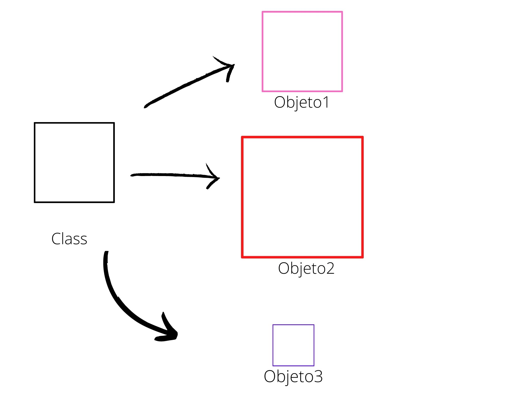

<div align="center">

# Resumo do conteúdo estudado.

</div>

### Essa semana resolvi sair um pouco do mundo procedural e ir para mundo  Orientado a Objetos. Confesso que no início não foi fácil, mas ao decorrer que estudava, o conteúdo ficava mais claro. 

### A mudança de paradigma é algo bem complexo se pensando em POO, mas pode ser facilitado por como você enxerga e entende o que é um objeto. 
### Um conceito legal para definir o que é POO seria, observar o mundo como um conjunto de objetos, e a relação que existe entre esses objetos. O objeto na POO é composto por atributos e comportamentos, ou seja, "características e ações".
### Qualquer objeto que você pensar no mundo real, possui características e comportamentos. Podemos dar como exemplo o carro. O carro pode ser azul ou branco. Pode ser da Ford ou da Fiat. Pode ter ar condicionado ou não. Essas são as características que um carro pode ter. Ah, e pensando nos comportamentos? O carro pode  andar, parar, estacionar, ligar ar condicionado. Os comportamentos seriam os "métodos" usados para o carro desempenhar determinada ação. Vamos ver um pouco disso na prática usando função

~~~python
     def andar():
         return "O carro está andando..."


~~~~

### Ah, Ramon, mas como isso entra no contexto de orientação a objetos? Precisamos antes de iniciar entender o que é classe.
### Classe seria um "molde" e objeto seria a instância criada a partir desse molde. Observe o exemplo abaixo:


### Temos por exemplo um "molde" que seria a class "quadrado", e os objetos1, 2 e 3 que seriam instâncias dessa classe quadrado. Você pode perceber que temos vários objetos quadrados com cores e tamanhos diferentes, mas todos seguem a classe quadrado.
### Vamos pensar nisso na prática:
~~~Python

    class Quadrado:
        def __init__(self,lado):
            self.lado = lado
~~~
### Isso seria a criação da classe quadrado, com um dos seus atributos seria lado. Mas como criar um objeto?
### Primeiro, no seu terminal ou quando fosse chamar essa classe em seu código, a forma correta seria:
```
quadrado_1 = Quadrado(2)
```
### Nesse caso, estamos instânciando o objeto quadrado_1 a classe Quadrado. O número intero 2, entre parentes, é o atributo do objeto criado, ou seja, o lado do quadrado. Uma coisa que pode estar te deixando confuso seria o o init antes de passar os atributos, e o self sendo passado como atributo. Vamos por partes:
- Self -> Seria  a referência do objeto que está sendo construido em memória. Estamos dizendo, o Atributo que está sendo atribuido se referência ao atributo em memória. Ficou meio redundande, mas seria mais ou menos isso:
``` 
   self.(atributo_memória) = (atributo_sendo_atribuido)

  por exemplo:

  self.nome = nome

   ```
### O nome atribuido pelo usuário na contrução do objeto, é instanciado ao "Molde" "nome" na classe. Esse conceito é um pouco complexo, mas ao decorrer que o conteúdo é estudado as informações ficam mais claras.
### Outro ponto que é importante destacar é o init com 2 undercores de cada lado. O init com os 2 undercores de cada lado é um metodo especial, contrutor da classe. Ou seja, responsável por criar o objeto daquela classe. Nem sempre o seu projeto exige essa função, mas se for exigido, nela estará contido todas as informações principais do objeto.
---
### 


"""Conceito aprendido:

   Atualmente, conseguimos mudar o valor dos atributos da nossa classe. Por exemplo, conseguimos mudar o saldo da conta simplemente atribuindo um valor a ele:

   conta.saldo = 10000  #Isso é um problema, pois estamos alterando diretamente o saldo.

   O saldo da conta só deve ser alterado com os métodos deposita e saca.Então para resolvermos este problema, torne - os privados, ou seja, adicionando 2 underscores à frente dos atributos:

   def __init__(self, numero, titular, saldo, limite):
    print("Construindo objeto ... {}".format(self))
    self.__numero = numero
    self.__titular = titular
    self.__saldo = saldo
    self.__limite = limite


#Mais uma ponderação sobre classes:

   uma classe deve ter apenas uma responsabilidade (ou deve ter apenas uma razão para existir). Em outras palavras, ela não deve assumir responsabilidades que não são delas.(princípio de responsabilidade única)
"""

#Aula proprieda (@property)

'''class Cliente:
        def __init__(self,nome):
                self.__nome = nome
        
        @property
        def nome(self):
                return self.__nome.title()

        @nome.setter
        def nome(self,nome):
                self.__nome = nome


cliente= Cliente("Ramon")
print(cliente.nome)
cliente.nome = "Bruna"
print(cliente.nome)'''


''' O python segue uma convenção para deixar atributos e métodos privados, por exemplo:
           def __init__(self,nome,numero_conta):
                   self.__nome = nome
                   self.__numero_conta = numero_conta
    se você perceber, colocamos 2 undescors antes do atributo. Se você chamar o atributo, o python avisa que aquele atributo é privado.
    Também é possível fazer isso com método, por exemplo:
           def __nomed0método(self):
                   -o que irá fazer-

É importante obser, pois, quando dentro da classe você for chamar o método caso seja necessário, é preciso chamar com os dois undercors. Mas não será possivel o usuário chamar esse método. '''